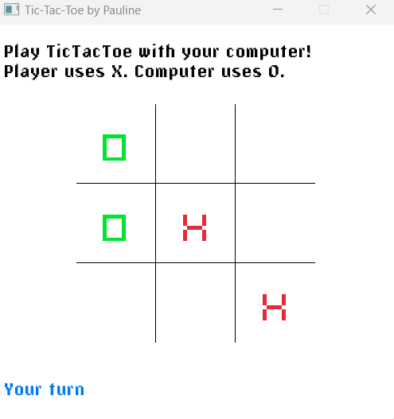

# tictactoe-minimax
Player vs computer TicTacToe using the minimax algorithm, done in C# and uses the [C# port of Raylib](https://github.com/ChrisDill/Raylib-cs) by .@ChrisDill
# About the computer opponent
The solution was inspired by this excellent [Medium article](https://medium.com/analytics-vidhya/artificial-intelligence-at-play-connect-four-minimax-algorithm-explained-3b5fc32e4a4f)
about the well-known minimax algorithm. The article covers the game "Connect4", but the solution is also
applicable to a TicTacToe board (which is a smaller board and hence a smaller problem space)
In the current project, the computer is always treated as the minimizing player.
## Optimizations / de-optimizations
- Unlike the original article, my project does not currently implement the alpha-beta pruning
- The computer will always try to control the center of the board, initially
- Instead of a 2-dimensionally array, I chose to track each player's positions as char[]s, and the win states as ints produced from strings.
So instead of loops, checking for a winner is done by converting the player position to a string then to an int, then doing a bitwise `&` against the possible win states.

# About the font in the /resources folder
I don't have a license to redistribute the `pixantiqua` font, but for your own purposes, you can copy it from the 
official [Raylib CS repo](https://github.com/ChrisDill/Raylib-cs/tree/master/Examples/resources/fonts)
OR
replace with a .ttf font of your own.
> For a preview of all the free fonts included in the original C version of raylib, please go [here](https://www.raylib.com/examples/text/loader.html?name=text_raylib_fonts)

Enjoy!
